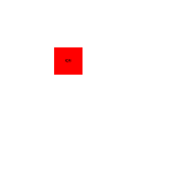
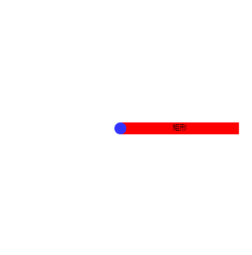
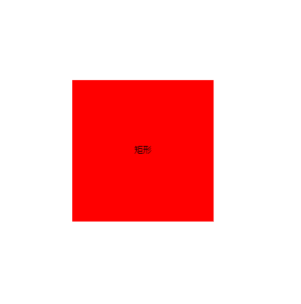
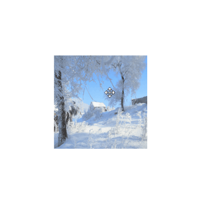
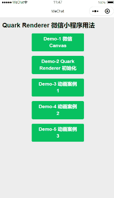

<p align="center">
    
</p>

<h1 align="center">Quark Renderer</h1>

A lightweight yet powerful Canvas(&SVG) render engine improved from [ZRender](https://github.com/ecomfe/zrender)

Home page https://quark-renderer.gitee.io

## Background

**Important: Quark Renderer is not built from scratch, but improved from ZRender, which is the render engine behind ECharts.**

I have used ECharts and ZRender for many years, both of them are extremly powerful tools for making some charting stuff.

To better understand the core ideas behind ZRender, I spent some days (2020-01) to read through its source code. In this process, I refactored a bunch of code and comments, because:

- I want a very customized version to implement some cool stuff in the future.
- I want a cleaner repo to teach my students how to understand and design a canvas engine for modern web and Wechat mini-programs.
- I want to make the code easier to read.
- There are two reasons why I have to pick up a new name for this project. Firstly, ZRender exported a global variable 'zrender', therefore a new name can avoid potential conflicts. Secondly, duplicated names are not allowed in npm registry.

Here are the key improvements compare to the original ZRender:

- Modified a bunch of classes and .js files with ES6 syntax.
- Added keyboard event support.
- Added multi drag-drop feature.
- Refactored the structure of .js files and directories for better understanding.
- Refactored some implementation details for better understanding.
- Fixed some bugs in /test directory, added a few test cases.
- Use [jsduck](https://github.com/senchalabs/jsduck) for better API documentation.
- Refactored all the comments for jsduck.
- Support Wechat mini-program directly, do not need any hack.
- Support node-canvas environment directly, do not need any hack.
- Removed VML engine, because the marketshare of IE is very small now. 
- Added skew feature for transformation system.
- Added transform control for elements.
- Added link control for lines and shapes including a Microsoft Visio like link line, so we can link these elements now.
- Refactored Group so that it can be nested and restrict the position of child nodes.

## Usage

- Pull this repo to your local device.
- Run npm build.
- Check the examples inside /test directory.

Browser example:

```html
<!DOCTYPE html>
<html>
<head>
    <meta charset="utf-8" />
    <title>Animation</title>
    <script src="../dist/quark-renderer.js"></script>
    <meta name="viewport" content="width=device-width, initial-scale=1" />
    <style>
        html, body, #main {
            width: 100%;
            height: 100%;
        }
    </style>
</head>
<body>
    <div id="main"></div>
    <script type="text/javascript">
        let main = document.getElementById('main');
        let qr = QuarkRenderer.init(main);
        
        let gradient = new QuarkRenderer.LinearGradient();
        gradient.addColorStop(0, 'red');
        gradient.addColorStop(1, 'black');

        let circle = new QuarkRenderer.Circle({
            position: [0, 0],
            scale: [1, 1],
            shape: {
                cx: 50,
                cy: 50,
                r: 50
            },
            style: {
                fill: gradient,
                lineWidth: 5,
                text:'circle',
                textPosition:'inside'
            }
        });
        qr.add(circle);
        
        // first animation process
        circle.animate()
            .when(1000, {
                position: [200, 0],
                scale: [2, 1]
            })
            .when(2000, {
                position: [200, 200],
                scale: [1, 1]
            })
            .when(3000, {
                position: [0, 200],
                scale: [1, 2]
            })
            .when(4000, {
                position: [0, 0],
                scale: [1, 1]
            })
            .during(function(){
                console.log(circle.animationProcessList.length);
            })
            .done(function(){
                console.log(circle.animationProcessList.length);
            })
            .start();//.start(true)

        //second animation process
        circle.animate()
            .when(1000, {
                position: [500, 0],
                scale: [2, 1]
            })
            .when(2000, {
                position: [200, 200],
                scale: [1, 1]
            })
            .when(3000, {
                position: [0, 200],
                scale: [1, 2]
            })
            .when(4000, {
                position: [0, 0],
                scale: [1, 1]
            })
            .during(function(){
                console.log(circle.animationProcessList.length);
            })
            .done(function(){
                console.log(circle.animationProcessList.length);
            })
            .start();//.start(true)
    </script>
</body>
</html>
```

Wechat mini-program example:

```html
<view class="page">
    <view class="page__hd">
        <view class="page__title">Quark Renderer 小程序示例1</view>
    </view>
    <view class="page__bd page__bd_spacing">
        <view style="width:100%;height:500px;">
            <canvas style="width: 300px; height: 500px;" canvas-id="firstCanvas"></canvas>
        </view>
    </view>
</view>
```

```javascript
onReady: function () {
    let ctx = wx.createCanvasContext('firstCanvas');
    //注意这里的初始化参数，因为微信小程序不允许操作 DOM，所以引擎不能自动获取到宽度高度，这里需要手动传进去
    let qr = QuarkRenderer.init(ctx,{width:300,height:500,renderer:'canvas'});
    let polygon = new QuarkRenderer.Polygon({
        position: [100, 100],
        scale: [1, 1],
        style: {
            fill: 'red'
        }
    });

    setInterval(function () {
        let len = Math.round(Math.random() * 100);
        let points = [];
        let r = (Math.random() * 100);
        for (let i = 0; i <= len; i++) {
            let phi = i / len * Math.PI * 2;
            let x = Math.cos(phi) * r + 100;
            let y = Math.sin(phi) * r + 100;
            points.push([x, y]);
        }
        polygon.animateTo({
            shape: {
                points: points
            }
        }, 500, 'cubicOut');
    }, 1000);
    qr.add(polygon);
}
```

## Document

The document is in /api directory, open /api/index.html in your browser then you can see a beautiful API document just like Sencha(ExtJS).


## ScreenShots


<br/>

<br/>

<br/>

<br/>

<br/>

<br/>

<br/>

<br/>

VisioLink like the line in Microsoft Visio.
<br/>


Wechat mini-program example:



## Resources

[https://cloud.tencent.com/edu/learning/live-1902?ADTAG=xyj ](https://cloud.tencent.com/edu/learning/live-1902?ADTAG=xyj )


## License

BSD 3-Clause License

[LICENSE](./LICENSE)