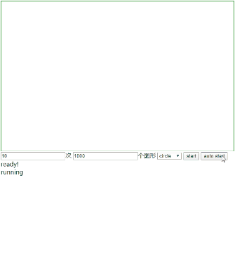

<h1 align="center">Quark Renderer</h1>

A lightweight yet powerful canvas (&svg) render engine improved from [ZRender](https://github.com/ecomfe/zrender)

## Background

**Important: Quark Renderer is not built from scratch, but improved from ZRender, which is the render engine behind ECharts.**

I have used ECharts and ZRender for many years, both of them are extremly powerful tools for making some charting stuff.

To better understand the core ideas behind ZRender, I spent some days (2020-01) to read through its source code. In this process, I refactored a bunch of code and comments, because:

- I want a very customized version to implement some cool stuff in the future.
- I want a cleaner repo to teach my students how to understand and design a canvas engine for modern web and Wechat mini-programs.
- I want to make the code easier to read.
- ZRender exported a global variable 'zrender', so I have to rename my repo to a different name to avoid potential naming conflicts. 

Here are the key improvements compare to the original ZRender:

- Modified a bunch of classes and js files with ES6 syntax.
- Added keyboard event support.
- Added multi drag-drop feature.
- Refactored the structure of js files and directories for better understanding.
- Refactored some implementation details for better understanding.
- Fixed some bugs in /test directory.
- Use [jsduck](https://github.com/senchalabs/jsduck) for better API document.
- Refactored all the comments for jsduck.

## Usage

**Pull this repo to your local device, check the examples inside /test directory.**

Example:

```html
<!DOCTYPE html>
<html>
<head>
    <meta charset="utf-8" />
    <title>Animation</title>
    <script src="../dist/quark-renderer.js"></script>
    <meta name="viewport" content="width=device-width, initial-scale=1" />
    <style>
        html, body, #main {
            width: 100%;
            height: 100%;
        }
    </style>
</head>
<body>
    <div id="main"></div>
    <script type="text/javascript">
        let main = document.getElementById('main');
        let qr = qrenderer.init(main);
        let gradient = new qrenderer.LinearGradient();
        gradient.addColorStop(0, 'red');
        gradient.addColorStop(1, 'black');

        let circle = new qrenderer.Circle({
            position: [0, 0],
            scale: [1, 1],
            shape: {
                cx: 50,
                cy: 50,
                r: 50
            },
            style: {
                fill: gradient,
                lineWidth: 5,
                text:'circle',
                textPosition:'inside'
            }
        });
        qr.add(circle);
        
        let ap=circle.animate('', true)
            .when(1000, {
                position: [200, 0],
                scale: [2, 2]
            })
            .when(2000, {
                position: [200, 200],
                scale: [1, 1]
            })
            .when(3000, {
                position: [0, 200],
                scale: [1, 1]
            })
            .when(4000, {
                position: [0, 0],
                scale: [1, 1]
            })
            .start();

        setTimeout(()=>{
            ap.stop();
        },5000);
    </script>
</body>
</html>
```

## Document

The document is in /api directory, open /api/index.html in your browser then you can see a beautiful API document just like Sencha(ExtJS).

## ScreenShots


<br/>

<br/>


## License

BSD 3-Clause License

[LICENSE](./LICENSE)